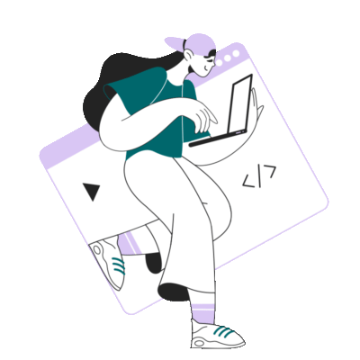

<h1 align="center">Salam! Hi there, I'm Masuma Jaffery </h1>
<p align = "center"><a href="https://git.io/typing-svg"></a></p>
<p></p>
<a href="https://komarev.com/ghpvc/?username=MasumaJaffery&color=blue"> 
  
</a> 
<a href="https://github.com/MasumaJaffery">  
       
</a>

|  |  |  |  |  |  |  |  |  |  |  |  |  |  |  |
|---|---|---|---|---|---|---|---|---|---|---|---|---|---|---|            

```javascript
import SoftwareDeveloper from 'iCodeDreams';
import { Languages, Frameworks } from 'Microverse/skills';

class Bio extends SoftwareDeveloper {
  name     = 'Syeda Masuma Fatima';
  nickname = 'Guriya Zehra';
  title    = 'Software Engineer || Founder || خادم آلِ يـٰس ';
} 

class Skills extends SoftwareDeveloper {
  languages  = ['JavaScript', 'TypeScript', 'Ruby on Rails', ...Languages];
  databases  = ['MySQL', 'Firebase', 'PostgreSQL'];
  frameworks = ['React', 'Next.js', 'Elementor', 'Nest.js', ...Frameworks];
}

```
<!--
**MasumaJaffery/MasumaJaffery** is a ✨ _special_ ✨ repository because its `README.md` (this file) appears on your GitHub profile

Here are some ideas to get you started: 

- 🔭 I’m currently working on ...
- 🌱 I’m currently learning ...
- 👯 I’m looking to collaborate on ...
- 🤔 I’m looking for help with ...
- 💬 Ask me about ...
- 📫 How to reach me: ...
- 😄 Pronouns: ...
- ⚡ Fun fact: ...
-->
<div class="flex">
    
    <a href="https://git.io/streak-stats">
        
    </a>
</div>
<p align="center">
</p>
