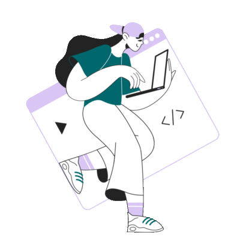

### [Salam] Hi there 👋

### I'm currently learning 🤓

 <a href="https://www.w3schools.com/css/" target="_blank">  

 

  

<!--
**MasumaJaffery/MasumaJaffery** is a ✨ _special_ ✨ repository because its `README.md` (this file) appears on your GitHub profile

Here are some ideas to get you started:

- 🔭 I’m currently working on ...
- 🌱 I’m currently learning ...
- 👯 I’m looking to collaborate on ...
- 🤔 I’m looking for help with ...
- 💬 Ask me about ...
- 📫 How to reach me: ...
- 😄 Pronouns: ...
- ⚡ Fun fact: ...
-->

  
  
  
   
   
 

